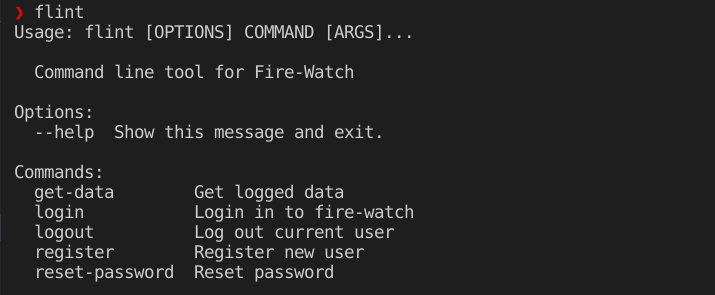

<!-- <div align="center">
  
</div>
 -->
<br>
<p align="center">
<b>CLI support for Fire-Watch</b>
</p>

<p align="center">
  
  
  
  
  
  
</p>

## 💡 Project Description

Log and manager IoT device clusters at once through a single dashboard/CLI with realtime alerts.

## 📌 Prerequisites

### 💻 System requirement :

1. Any system with basic configuration.
2. Operating System : Unix

### 💿 Software requirement :
1. Python installed (If not download it [here](https://www.python.org/downloads/)).

## Installation 🔧

### Install Flint

```
$ git clone https://github.com/Aradhya-Tripathi/flint.git
$ cd flint
$ pip install .
or
$ poetry install

```


## 📜 License

`flint` is available under the MIT license. See the LICENSE file for more info.

## 💥 Contributors

<a href="https://github.com/Aradhya-Tripathi/flint/graphs/contributors">

</a>

## 🚨 Forking this repo

Many people have contacted us asking if they can use this code for their own websites. The answer to that question is usually "yes", with attribution. There are some cases, such as using this code for a business or something that is greater than a personal project, that we may be less comfortable saying yes to. If in doubt, please don't hesitate to ask us.

We value keeping this site open source, but as you all know, _**plagiarism is bad**_. We spent a non-negligible amount of effort developing, designing, and trying to perfect this iteration of our website, and we are proud of it! All we ask is to not claim this effort as your own.

So, feel free to fork this repo. If you do, please just give us proper credit. Refer to this handy [quora post](https://www.quora.com/Is-it-bad-to-copy-other-peoples-code) if you're not sure what to do. Thanks!
